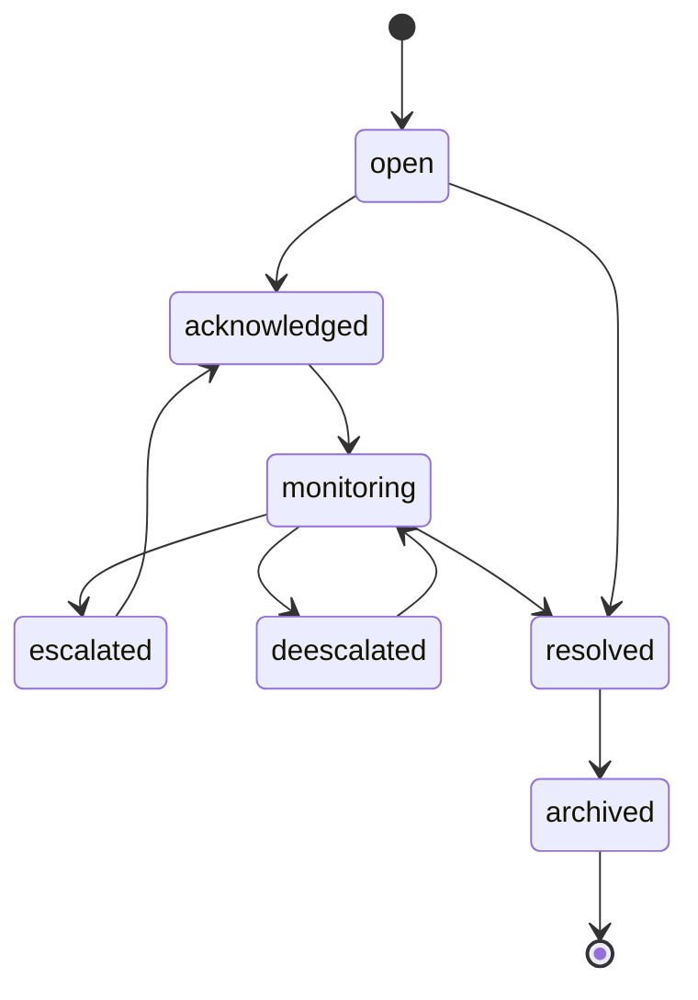

# 预警事件模型

状态：`Draft`

最后更新：2026-05-30

## 1. 目标

定义预警事件的触发、升级、降级、确认、解除和审计模型。预警事件是风险评分从“数字”变成“可管理事项”的关键。

## 2. 事件类型

```text
risk_watch          L1 观察
risk_stress         L2 压力
risk_warning        L3 预警
risk_crisis         L4 危机
data_quality_issue  数据质量事件
source_health_issue 数据源健康事件
manual_note         人工备注
```

金融风险事件和数据质量事件要分开，避免数据源故障被误认为金融危机。

## 3. 事件状态



状态说明：

| 状态 | 说明 |
|---|---|
| `open` | 系统触发，尚未确认 |
| `acknowledged` | 人工已确认看到 |
| `monitoring` | 持续跟踪中 |
| `escalated` | 等级升级 |
| `deescalated` | 等级降级 |
| `resolved` | 已解除 |
| `archived` | 归档 |

## 4. 触发条件

事件触发来源：

- 整体风险等级变化。
- 维度风险等级变化。
- 核心指标突破阈值。
- 事件类数据出现重大事件。
- 数据质量或数据源健康异常。

默认规则：

- L1 可只记录，不强制通知。
- L2 进入预警记录。
- L3/L4 需要人工确认。
- 数据质量事件不参与金融风险等级，但影响评分可信度。

## 5. 事件字段

```text
alert_id
event_type
scope
entity_id
dimension
level
status
triggered_at
triggered_as_of_date
resolved_at
score
previous_score
trigger_reason
top_contributors
related_indicators
data_quality_summary
method_version
created_by
acknowledged_by
acknowledged_at
```

## 6. 事件去重

同一风险在未解除前不应反复创建新事件。

去重 key：

```text
event_type
scope
entity_id
dimension
level_bucket
```

如果已有 open/monitoring 事件：

- 分数继续升高：写入 history。
- 等级升级：状态改为 escalated。
- 等级降低但未解除：状态改为 deescalated。
- 低于解除阈值并持续足够周期：resolved。

## 7. 升级规则

升级条件：

- 事件等级提高。
- 影响范围扩大。
- Top contributor 新增重大指标。
- 人工确认外部事件。

升级记录：

```text
from_level
to_level
from_score
to_score
reason
contributors_delta
```

## 8. 解除规则

解除条件：

- 连续 3 个评分周期低于当前等级阈值。
- 触发指标回落。
- 没有新的事件类触发。
- 数据质量恢复。

L3/L4 解除需要人工确认或自动解除后人工复核。

## 9. 通知策略

第一版可以只做面板内通知。后续再扩展邮件、Webhook、Slack、企业微信等。

通知优先级：

| 等级 | 优先级 | 默认动作 |
|---|---|---|
| L1 | 低 | 面板记录 |
| L2 | 中 | 面板提醒 |
| L3 | 高 | 面板 + 外部通知 |
| L4 | 紧急 | 面板 + 外部通知 + 确认 |
| 数据质量 | 中 | 运维提醒 |

## 10. 审计要求

所有人工操作必须进入 history：

- 确认。
- 备注。
- 手工升级。
- 手工降级。
- 手工解除。
- 修改阈值或权重导致事件变化。

事件详情页需要展示完整历史。

