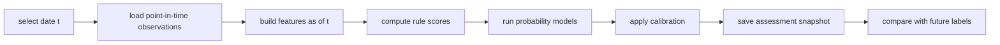

# 真实回测执行设计

状态：`Draft`

最后更新：2026-05-30

## 1. 目标

把回测从概念层推进到可执行层，定义任务如何逐日运行、如何避免未来函数、如何产出真实结果。

## 2. 范围

覆盖：

- 标签生成
- 特征快照生成
- 规则评分
- 概率模型推理
- 校准
- 场景与全历史结果落库

## 3. 执行单元

### 3.1 Scenario Backtest

围绕单一场景运行：

- `us_gfc_2008`
- `us_covid_liquidity_2020`
- `us_rate_shock_2022`
- `us_regional_banks_2023`

### 3.2 Rolling History Backtest

对连续时间段逐日运行。

## 4. 核心执行流



## 5. 输入

```text
backtest_run_id
date_range
scenario_id nullable
entity_id
feature_set_version
score_method_version
prob_model_version
calibration_version
label_version
point_in_time_mode
```

## 6. Point-in-time 模式

### 6.1 strict

- 只使用当时真实可见数据

### 6.2 best_effort

- 没有发布时间时按保守 lag 近似

第一阶段允许 `best_effort`，但必须记录。

## 7. 每日输出

每个 `as_of_date` 输出：

```text
assessment_snapshot
feature_snapshot_ref
raw_probabilities
calibrated_probabilities
posture
conviction
top_drivers
data_quality_summary
```

## 8. 场景输出

每个场景输出：

```text
scenario_id
first_prepare_date
first_hedge_date
first_defend_date
first_high_p5d_date
first_high_p20d_date
lead_time_days
false_positive_count
max_probability
top_driver_timeline
```

## 9. 落库对象

```text
analytics_backtest_runs
analytics_backtest_daily_results
analytics_backtest_scenario_summaries
analytics_backtest_metrics
```

## 10. 评估维度

### 10.1 概率质量

- Brier
- Log loss
- calibration error

### 10.2 提前量

- 首次 `p_5d` 超阈值提前量
- 首次 `p_20d` 超阈值提前量
- 首次 posture 升级提前量

### 10.3 误报

- 高概率但未进危机窗口的天数
- 连续高概率误报区间

### 10.4 稳定性

- posture 切换次数
- probability oscillation

## 11. Worker 命令建议

```text
backtest run --scenario us_gfc_2008
backtest run --from 2006-01-01 --to 2024-12-31
backtest report --run-id <id>
```

## 12. 与旧回测设计的关系

- 旧文档说明“评估什么”
- 本文档说明“怎么跑”

## 13. 第一阶段实现顺序

1. 跑单场景
2. 跑连续历史
3. 输出前端摘要

## 14. 风险

- 严格 point-in-time 数据不足
- 事件发布时间难完全对齐
- SQLite 在长区间回测时可能成为瓶颈
