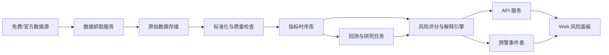

# 全局设计

状态：`Draft`

最后更新：2026-05-30

## 1. 目标

建设一个金融危机预警系统，用于持续观察宏观、市场、信用、银行、房地产、公告和新闻事件等数据，输出当前整体风险评估、分项风险评估、主要风险贡献和指标细项。

第一阶段目标不是预测某一天会发生危机，而是提供一个可解释、可回测、可扩展的风险监控系统。

## 2. 非目标

第一阶段暂不追求：

- 直接替代 Bloomberg、Wind、Refinitiv 等商业终端。
- 分钟级全市场实时行情。
- 黑盒深度学习危机预测。
- 自动交易或投资建议。
- 对所有国家和所有资产类别一次性全覆盖。

## 3. 核心判断框架

系统应分成三层风险判断。

### 3.1 慢变量：系统脆弱性

慢变量用于判断危机土壤，通常是月度、季度或年度数据。

典型指标：

- 信贷/GDP 缺口
- 居民、企业、政府杠杆率
- 外债、短债和外储
- 财政赤字和经常账户
- 房价收入比、房价租金比
- 银行资本充足率、不良率、存贷比

慢变量不需要实时，但决定系统是否处于易燃状态。

### 3.2 快变量：市场压力

快变量用于捕捉触发信号，通常是日频、小时级或分钟级数据。

典型指标：

- 股指回撤、波动率、成交量异常
- VIX 或本地市场波动率指标
- 信用利差、国债期限利差
- 汇率贬值、外汇波动率
- 银行间利率、回购利率、美元流动性指标
- 黄金、原油、铜等风险偏好和通胀相关资产

第一版建议做到日频，后续再升级为分钟级。

### 3.3 事件变量：政策、公告和新闻

事件变量用于捕捉突发触发因素。

典型事件：

- 违约公告
- 评级下调
- 银行流动性事件
- 监管政策变化
- 大型机构亏损、破产、救助
- 地缘政治或供应链冲击

事件变量可以先做规则和关键词抽取，后续再引入 NLP 或 LLM 做实体识别、事件分类和情绪评分。

## 4. 总体架构



## 5. 模块边界

### 5.1 数据抓取服务

职责：

- 管理数据源连接器。
- 支持定时抓取、回填、重试和限流。
- 保存原始响应，避免只保存清洗后的结果。
- 记录抓取时间、水位线、HTTP 状态、版本和错误。

不负责：

- 风险评分。
- 页面展示。
- 复杂模型训练。

### 5.2 数据标准化服务

职责：

- 将不同来源的数据转为统一指标格式。
- 处理频率、币种、单位、缺失值和修订版本。
- 给每个指标绑定元数据，包括来源、更新频率、风险方向、使用许可、延迟和质量等级。

### 5.3 指标库

职责：

- 存储指标元数据。
- 存储标准化时间序列。
- 存储质量检查结果。
- 支持按国家、市场、资产类别、频率、来源查询。

建议：

- PostgreSQL 存储元数据和预警事件。
- TimescaleDB 存储高频和中频时间序列。
- Parquet 归档原始数据和回测快照。

### 5.4 风险评分与解释引擎

职责：

- 计算单指标风险分。
- 汇总维度风险分。
- 汇总整体风险分。
- 输出预警等级、风险贡献和解释文本。

第一版优先采用规则评分卡：

- 历史分位数
- Z-score
- 同比/环比变化
- 滚动波动率
- 最大回撤
- 利差变化
- 阈值突破持续天数

后续再加入统计模型和机器学习模型。

### 5.5 API 服务

职责：

- 面向前端提供风险概览、指标细项、趋势、预警记录和数据质量信息。
- 面向内部任务提供指标查询和评分结果查询。

建议使用：

- Rust
- Axum
- Tokio
- sqlx

### 5.6 Web 风险面板

职责：

- 展示整体风险等级和风险分。
- 展示宏观、市场、信用、银行、房地产、事件等分项评分。
- 展示最近变化最大的风险项。
- 展示指标细项、历史趋势和阈值。
- 展示预警记录和解释。
- 支持从整体风险下钻到数据源和原始指标。

建议使用：

- React
- TypeScript
- Vite
- ECharts
- TanStack Query
- TanStack Table

## 6. 建议技术栈

```text
后端服务：Rust + Tokio + Axum
数据库访问：sqlx
任务调度：Rust worker + PostgreSQL job table，后续可引入 NATS
主数据库：PostgreSQL
时序扩展：TimescaleDB
归档格式：Parquet
批量分析：Polars 或 DuckDB
前端：React + TypeScript + Vite
图表：ECharts
监控：tracing + Prometheus + Grafana
部署：Docker Compose 起步
```

保留 Python 作为后续研究和模型实验环境，不建议第一阶段让 Python 承担核心生产服务。

## 7. 风险评分输出形态

建议统一输出如下结构：

```text
risk_snapshot
  as_of_date
  region
  market_scope
  overall_score
  overall_level
  level_reason
  top_contributors
  dimension_scores
  data_quality_summary
```

分项风险等级建议：

- `L0 Normal`：正常
- `L1 Watch`：观察
- `L2 Stress`：压力
- `L3 Warning`：预警
- `L4 Crisis`：危机

评分必须能回答三个问题：

- 当前风险为什么高？
- 哪些指标贡献最大？
- 这个信号在历史上是否有效？

## 8. 页面设计边界

第一版面板建议包含：

- 总览页：整体风险、分项风险、主要贡献、最近触发信号。
- 指标页：指标列表、当前值、历史分位、风险方向、数据质量。
- 指标详情页：时间序列、阈值、评分过程、来源链接。
- 预警记录页：触发时间、等级、原因、解除状态。
- 数据源页：数据源状态、最近抓取时间、失败率、延迟。
- 回测页：历史危机前后的评分变化。

## 9. 初始 MVP 建议

第一版建议选择“免费数据源可覆盖度最高”的范围：

- 区域：美国为主，全球宏观作为辅助。
- 频率：日频市场压力 + 月度/季度宏观脆弱性。
- 数据源：FRED、World Bank、IMF、BIS、ECB、SEC、GDELT，必要时用 yfinance 或 Alpha Vantage 补充市场价格。
- 评分：规则评分卡。
- 面板：总览、指标细项、数据源状态、预警记录。

暂不建议第一版直接做中国市场分钟级预警，因为稳定、合法、低成本的实时行情和债券数据接入难度更高。

## 10. 主要风险

- 免费数据源实时性有限。
- 免费数据源授权条款不一定允许商业化使用。
- 宏观数据存在发布滞后和历史修订。
- 不同数据源单位、频率、时区和节假日不同。
- 危机样本稀少，模型容易过拟合。
- 只输出概率而不输出解释会降低系统可信度。

## 11. 下一轮需要细分设计的部分

详见 [第二轮细分设计清单](../roadmap/second-round-design-backlog.md)。

优先级最高的细分项：

1. 免费数据源目录与连接器规范。
2. 指标体系与风险评分方法。
3. 数据库 schema 与数据质量模型。
4. Web 面板信息架构。
5. 回测和评估方法。

