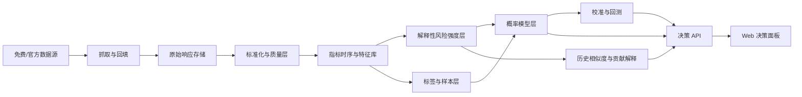

# 全局设计

状态：`Draft`

最后更新：2026-05-30

## 1. 目标

建设一个以美国金融系统为主、以免费数据为基础的金融危机概率评估系统。

系统的核心任务不是展示一个抽象风险分，而是回答四个直接问题：

1. 当前是否处在系统性风险显著升高阶段？
2. 未来 `5` 个交易日、`20` 个交易日、`60` 个交易日内，进入危机或急性流动性冲击窗口的概率分别是多少？
3. 当前离危险更像是“数月”“数周”还是“当下”？
4. 为什么系统这样判断，和 `2008`、`2020`、`2023` 等历史压力阶段相比处在什么位置？

这个系统的最终用途是支持持仓管理、风险资产减仓、保护性对冲和流动性防守，而不是单纯做宏观研究展示。

## 2. 非目标

第一阶段暂不追求：

- 分钟级全市场实时撮合或交易执行。
- 对所有国家和资产类别同时覆盖。
- 只用一个黑盒数字替代所有解释。
- 给出未经校验的个股、行业或期权具体交易建议。
- 把“风险分高”直接当成“官方危机已经发生”。

## 3. 核心产品定义

系统输出应该从单一风险分扩展为四层结果。

### 3.1 概率层

对同一评估日输出三个 horizon probability：

- `p_5d`：未来 5 个交易日进入急性风险窗口的概率。
- `p_20d`：未来 20 个交易日进入风险资产深跌或流动性冲击窗口的概率。
- `p_60d`：未来 60 个交易日进入系统性高风险阶段的概率。

### 3.2 时距层

将概率和触发结构转成更容易理解的距离判断：

- `months`：风险更像是中期积累。
- `weeks`：风险已经接近触发窗口。
- `now`：风险可能已经进入当下处理区间。

### 3.3 解释层

同时输出：

- 结构脆弱性
- 触发压力
- 外部冲击
- 关键贡献指标
- 数据可信度
- 历史相似阶段

### 3.4 决策支持层

系统不直接替用户做交易，但要给出可操作的 posture：

- `normal`：正常持有
- `prepare`：降低净敞口、提高现金占比
- `hedge`：考虑保护性对冲
- `defend`：优先流动性和资本保全

## 4. 概率定义

本系统中的“危机概率”不是宏观上的抽象衰退概率，而是严格定义的条件概率：

```text
P(未来 H 个交易日内进入某类危机窗口 | 截至今天可见的数据)
```

其中 `H ∈ {5, 20, 60}`。

第一阶段重点覆盖三类目标事件：

1. `acute_liquidity_shock`
   - 流动性急剧恶化
   - 波动率飙升
   - 风险资产快速杀跌

2. `banking_funding_stress`
   - 银行/金融机构融资压力
   - 存款外流
   - 监管或救助事件

3. `broad_risk_asset_drawdown`
   - 美股、信用、波动率、利率等多资产共振
   - 风险资产进入深度回撤区间

## 5. 判断框架

整体判断分成三层。

### 5.1 结构脆弱性

回答“土壤是否易燃”：

- 宏观放缓
- 信用扩张和质量恶化
- 房地产和银行体系脆弱性
- 外部失衡和融资依赖

这层更偏 `60d` 视角。

### 5.2 触发压力

回答“最近是否接近点火”：

- VIX
- 信用利差
- 国债曲线和利率冲击
- 融资条件
- 银行和市场流动性

这层主要影响 `5d` 和 `20d`。

### 5.3 外部冲击放大器

回答“是否存在外部杠杆链条把美国风险快速放大”：

- 日元套息交易
- 汇率剧烈波动
- 全球流动性挤压
- 重大政策/公告/新闻事件

这层是乘数项，不应在没有美国内部压力的情况下单独判定危机。

## 6. 范围

### 6.1 地域范围

- 主体：美国金融系统
- 辅助：全球慢变量
- 外部风险专题：日本及日元套息交易

### 6.2 频率范围

- 第一阶段：日频评估
- 第二阶段：事件和市场数据做到准实时刷新
- 慢变量继续接受月频、季频和年频

### 6.3 数据边界

坚持免费和官方优先：

- FRED Graph CSV / FRED API
- U.S. Treasury
- SEC EDGAR
- World Bank
- BOJ

非官方或原型源只能作为补充或回退，不能作为核心概率引擎的唯一输入。

## 7. 总体架构



## 8. 模块边界

### 8.1 抓取与回填

职责：

- 拉取免费和官方数据。
- 管理增量、水位线、回填、限流、重试。
- 保存原始响应和抓取元数据。

不负责：

- 概率计算
- UI 展示
- 标签定义

### 8.2 标准化与质量层

职责：

- 频率对齐
- 单位标准化
- 时区和发布日期处理
- 缺失值、修订值、发布滞后记录

### 8.3 指标时序与特征库

职责：

- 保存可解释指标
- 生成变化率、分位数、波动率、回撤等特征
- 为 `5d/20d/60d` 模型生成特征快照

### 8.4 解释性风险强度层

职责：

- 输出单指标分数
- 输出维度分数
- 输出结构/触发/外部三大分组
- 产出 Top contributors

说明：

这层仍然保留，但不再是最终产品定义。

### 8.5 标签与样本层

职责：

- 定义危机窗口
- 维护场景表
- 生成 horizon label
- 管理 point-in-time 回测样本

### 8.6 概率模型层

职责：

- 利用解释性分数和原始特征输出多 horizon 概率
- 维护模型版本
- 输出校准前和校准后概率

### 8.7 校准与回测

职责：

- 评估提前量
- 评估误报/漏报
- 做概率校准
- 评估不同 horizon 的稳定性

### 8.8 决策 API 与面板

职责：

- 对外暴露当前概率、时距、原因、数据质量和历史对照
- 以“当前离风险多远”为核心表达，不再只显示风险分

## 9. 输出对象

每次评估至少输出以下对象：

```text
assessment_snapshot
  as_of_date
  p_5d
  p_20d
  p_60d
  time_to_risk_bucket
  structural_score
  trigger_score
  external_shock_score
  conviction_score
  top_risk_drivers
  top_relief_drivers
  historical_analogs
  suggested_posture
  data_quality_summary
  method_version
```

## 10. 历史对照

系统不能只告诉用户“现在高不高”，还要回答“历史上像谁”。

第一阶段默认对照以下美国场景：

- `2007-2009` 全球金融危机
- `2020-02` 到 `2020-04` 流动性冲击
- `2022` 通胀与利率重估
- `2023-03` 到 `2023-05` 区域银行危机

第二阶段新增：

- 日元套息反转导致的跨市场冲击样本
- 其他美元流动性挤压阶段

## 11. 决策表达原则

前端和 API 必须明确区分三类量：

1. `risk intensity`
   - 解释当前系统压力位置

2. `horizon probability`
   - 解释未来给定窗口内发生事件的概率

3. `decision posture`
   - 解释应该更偏正常、准备、对冲还是防守

不允许把这三者混成一个数字。

## 12. 数据和模型可信度

只给概率不够，还要给 conviction。

可信度主要来自：

- 核心数据源覆盖率
- 最近更新时间
- 是否存在缺失或代理变量
- 当前信号是否由多个维度共振
- 模型在历史样本上的命中和误报情况

## 13. 第一阶段实现顺序

1. 完成美国主线免费数据闭环。
2. 完成 crisis label 和 horizon 定义。
3. 保留解释性评分层，作为概率模型输入之一。
4. 建立 `5d/20d/60d` 概率模型和校准流程。
5. 建立真实历史回测，不再使用 demo 场景摘要替代。
6. 完成“离风险多远”导向的决策面板。
7. 增加 JPY carry 外部风险模块。

## 14. 主要风险

- 免费数据源在快变量层不完整。
- 宏观数据滞后和修订会污染回测。
- 危机样本少，概率模型容易不稳。
- 外部冲击模块容易在噪声中误报。
- 如果没有真实标签体系，概率会退化成伪数字。

## 15. 需要补齐的专题设计

本轮新增的关键设计文档：

1. `docs/analytics/horizon-label-design.md`
2. `docs/analytics/probability-engine-design.md`
3. `docs/analytics/decision-support-policy.md`
4. `docs/data/us-centric-free-data-plan.md`
5. `docs/data/jpy-carry-risk-module-design.md`
6. `docs/product/decision-dashboard-design.md`
7. `docs/roadmap/crisis-probability-design-todo.md`
