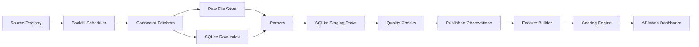

# 本地 SQLite 历史数据总体设计

状态：`Draft`

最后更新：2026-05-30

## 1. 目标

把系统第一阶段改成“本地优先”的历史数据平台：

- 免费数据源可以在个人电脑上回填。
- SQLite 保存元数据、抓取状态、标准化时序、评分快照和预警事件。
- 原始响应可追溯，但不把大对象全部塞进数据库。
- 后续可以迁移到 PostgreSQL/TimescaleDB，而不重写业务层。

## 2. 总体架构



## 3. SQLite 使用边界

### 3.1 适合

- 本地开发。
- 个人部署。
- 日频、周频、月频、季频、年频历史数据。
- 单机回测和可解释评分。
- 一个写入进程，多个读取进程。

### 3.2 不适合

- 多节点抓取集群。
- 多用户高并发写入。
- 秒级/分钟级高频行情全量存储。
- 大规模参数搜索和并行模型训练。

## 4. 本地目录

```text
data/
  fc-local.sqlite
  raw/
    fred/
    world_bank/
    sec_edgar/
    gdelt/
  exports/
  backups/
migrations/
  sqlite/
  postgres/
```

原则：

- SQLite 文件只保存结构化索引和标准化记录。
- 原始响应保存为文件，推荐 `json.gz` 或 `csv.gz`。
- 数据库中保存 raw file path、hash、content type、parser version。

## 5. 逻辑表映射

现有 [数据库 Schema 设计](../data/storage-schema.md) 是逻辑模型。SQLite 版不使用 schema namespace，使用前缀命名：

| 逻辑 schema | SQLite 表前缀 | 示例 |
|---|---|---|
| `metadata` | `metadata_` | `metadata_sources` |
| `ingest` | `ingest_` | `ingest_runs` |
| `raw` | `raw_` | `raw_responses` |
| `staging` | `staging_` | `staging_observations` |
| `quality` | `quality_` | `quality_results` |
| `analytics` | `analytics_` | `analytics_risk_snapshots` |
| `alerts` | `alerts_` | `alerts_events` |
| `audit` | `audit_` | `audit_log` |

## 6. 写入模型

SQLite 需要明确写入纪律：

- 只有一个 writer 负责数据库写入。
- fetcher 可以并发下载，但只能把原始文件和解析候选交给 writer。
- writer 每批使用事务提交。
- API 和 Web 只读，不直接写抓取表。
- 回测任务使用只读快照或导出文件，避免长事务阻塞增量更新。

建议启动参数：

```sql
PRAGMA journal_mode = WAL;
PRAGMA foreign_keys = ON;
PRAGMA busy_timeout = 5000;
PRAGMA synchronous = NORMAL;
```

## 7. 核心数据路径

### 7.1 历史回填

1. 根据 `metadata_external_indicator_mappings` 生成 backfill job。
2. connector 下载历史响应。
3. 原始响应写入 `data/raw/<source_id>/...`。
4. `raw_responses` 记录 request、hash、路径和状态。
5. parser 生成 `staging_observations`。
6. quality checks 通过后写入 `ts_indicator_observations`。
7. feature builder 生成风险特征。
8. scoring engine 生成 `analytics_risk_snapshots`。

### 7.2 增量更新

1. 每个 dataset 维护 watermark。
2. 增量请求只抓 watermark 之后的数据。
3. 数据源可能修订历史，connector 可配置 lookback window。
4. upsert 使用唯一键避免重复。
5. 如果数据修订，保留旧版本或记录 revision event。

## 8. 关键唯一键

| 表 | 推荐唯一键 |
|---|---|
| `raw_responses` | `source_id + request_hash + response_hash` |
| `staging_observations` | `run_id + indicator_id + entity_id + as_of_date + source_id` |
| `ts_indicator_observations` | `indicator_id + entity_id + as_of_date + source_id + vintage_date` |
| `analytics_risk_snapshots` | `as_of_date + entity_id + market_scope + method_version` |
| `alerts_events` | `event_fingerprint + triggered_at_date + method_version` |

## 9. 迁移路径

第一版实现时应定义 store trait：

```text
StorageBackend
  load_indicators()
  load_observations(entity_id, as_of_date)
  upsert_raw_response()
  upsert_observations()
  save_risk_snapshot()
  save_ingestion_run()
```

实现顺序：

1. `SqliteStore`：本地默认。
2. `PostgresStore`：保留现有生产路径。
3. `ObjectStore`：后续替换 raw file store。

业务层只能依赖 trait，不能直接依赖具体 SQL。

## 10. 备份与重建

- `data/raw/` 和 `fc-local.sqlite` 一起备份。
- 每次 schema migration 前自动备份 SQLite 文件。
- 支持从 raw 文件重建 staging 和 published observations。
- 支持导出 Parquet/CSV 供研究和回测使用。

## 11. 实现优先级

1. 增加 SQLite migrations。
2. 实现 `SqliteStore`。
3. 将 API demo/postgres 模式扩展为 `demo | sqlite | postgres`。
4. FRED connector 写入 SQLite。
5. World Bank、SEC、GDELT 逐步接入。
6. 回测从 SQLite 读取真实历史，而不是 demo 数组。

## 12. 风险

- SQLite 写锁导致抓取和评分互相等待：通过单 writer 和短事务处理。
- 原始文件路径移动导致追溯失败：raw index 使用相对路径，并提供完整性检查。
- JSON 字段在 SQLite 中弱约束：关键字段落结构化列，JSON 只放扩展元数据。
- 未来迁移成本：从一开始维护 PostgreSQL 兼容逻辑模型和 store trait。
