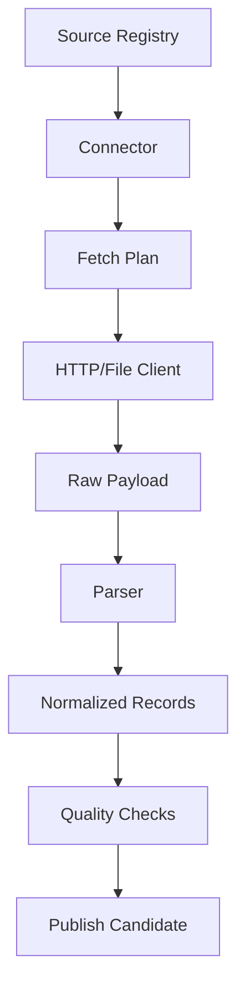

# 数据连接器契约

状态：`Draft`

最后更新：2026-05-30

## 1. 目标

定义所有数据源连接器必须遵守的接口、元数据、错误处理和质量要求。连接器契约的目标是让 FRED、SEC、World Bank、IMF、BIS、GDELT、市场数据等异构来源可以被同一套抓取、解析、校验和发布流程管理。

本文档是设计契约，不是代码实现。

## 2. 核心原则

- 抓取、解析、标准化、发布分离。
- 原始响应必须先保存，再解析。
- 每次抓取必须可追溯、可重试、可审计。
- 连接器不得直接写入已发布指标表。
- 连接器必须显式声明授权、限流、频率和数据质量预期。
- 非官方或原型数据源必须在元数据中标记，不能伪装成生产源。

## 3. 连接器分层



## 4. 连接器能力

每个连接器应声明能力：

| 能力 | 说明 |
|---|---|
| `discover` | 发现数据集、指标、元数据或公司列表 |
| `backfill` | 拉取历史数据 |
| `incremental` | 按水位线增量拉取 |
| `refresh_metadata` | 刷新指标和字段元数据 |
| `parse_raw` | 从原始响应解析结构化记录 |
| `normalize` | 转换为系统统一指标格式 |
| `validate` | 执行源内质量检查 |
| `supports_vintage` | 支持实时版本或历史修订版本 |

连接器可以只实现其中一部分能力，但必须在 registry 中声明。

## 5. 连接器输入

抓取任务输入包括：

```text
source_id
dataset_id
target_ids
run_mode
requested_start
requested_end
watermark
frequency
priority
retry_count
config_version
```

`run_mode` 可选：

- `discover`
- `backfill`
- `incremental`
- `repair`
- `metadata_refresh`

## 6. 连接器输出

连接器输出分三类。

### 6.1 Fetch 输出

```text
raw_payload_id
source_id
dataset_id
request_url
request_method
request_params_hash
response_hash
content_type
content_length
raw_object_uri
http_status
fetched_at
```

### 6.2 Parse 输出

```text
parsed_batch_id
raw_payload_id
schema_version
record_count
parse_warnings
normalized_records
```

### 6.3 Normalize 输出

标准化记录最少包含：

```text
indicator_id
entity_id
as_of_date
period_start
period_end
frequency
value
unit
currency
source_id
dataset_id
source_observation_id
revision_time
publication_time
raw_payload_id
quality_flags
```

## 7. 指标命名规则

系统内部指标 ID 使用稳定、语义化、低耦合命名。

建议格式：

```text
{region}_{domain}_{concept}_{variant}
```

示例：

- `us_market_vix_close`
- `us_credit_high_yield_oas`
- `us_rates_yield_curve_10y2y`
- `global_macro_gdp_growth`
- `us_filing_bank_8k_count`

不得直接把外部代码作为内部指标 ID。外部代码应放在 mapping 表中，例如 FRED 的 `VIXCLS` 映射到 `us_market_vix_close`。

## 8. 错误模型

错误分为：

| 错误类型 | 是否重试 | 示例 |
|---|---|---|
| `rate_limited` | 是 | HTTP 429 |
| `temporary_network` | 是 | 超时、连接重置 |
| `source_unavailable` | 是 | 5xx |
| `auth_failed` | 否，需人工处理 | API key 错误 |
| `invalid_request` | 否，需修配置 | 参数或 series code 错误 |
| `schema_changed` | 否，需修解析器 | 字段缺失或类型变化 |
| `quality_failed` | 视情况 | 异常缺失、重复、单位变化 |
| `license_blocked` | 否 | 授权禁止继续使用 |

错误必须写入抓取运行记录，不允许只写日志。

## 9. 限流和退避

连接器不得自行无限重试。统一由任务调度层控制：

- 每个 source 配置全局并发。
- 每个 endpoint 配置最小请求间隔。
- HTTP 429 使用指数退避。
- 重试次数超过阈值后进入 `failed_retryable`。
- 授权、schema、license 类错误进入 `failed_terminal`。

## 10. 幂等规则

同一个抓取任务重复执行时：

- 原始响应可以重复保存，但必须通过 hash 去重。
- 标准化记录按 `indicator_id + entity_id + as_of_date + source_id + revision_time` 去重。
- 已发布指标表不得出现语义重复记录。
- 修复任务可以覆盖候选区数据，但不能静默篡改已发布历史，需要记录 revision。

## 11. 配置版本

连接器配置需要版本化：

```text
config_version
source_id
dataset_id
endpoint_template
auth_ref
rate_limit_policy
parser_version
normalizer_version
quality_rule_version
effective_from
effective_to
```

当 parser 或 normalizer 变化时，历史回填要能标记使用了哪个版本。

## 12. 测试要求

每个连接器实现前应准备：

- 小型原始响应样本。
- 解析快照样本。
- 错误响应样本。
- 空数据样本。
- 字段缺失样本。
- 限流或重试模拟。

连接器测试目标：

- 能解析正常响应。
- 能保留原始响应追溯关系。
- 能识别 schema 变化。
- 能在重复运行时保持幂等。
- 能正确输出质量 flags。

## 13. Rust 实现提示

后续实现可采用 trait 形态：

```text
Connector
  describe()
  plan()
  fetch()
  parse()
  normalize()
  validate()
```

实现时建议：

- HTTP 客户端统一封装。
- API key 从 secret store 或环境变量引用，不写入配置表明文。
- 每个连接器只负责源特有逻辑。
- 任务状态、重试、发布由平台层控制。

