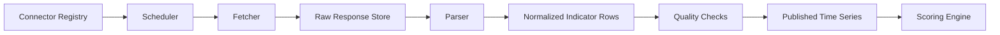

# 免费数据源与抓取设计

状态：`Draft`

最后更新：2026-05-30

## 1. 设计目标

本系统第一阶段优先验证免费或低成本数据源能否支撑一个可解释的金融危机预警闭环。

数据抓取设计需要解决：

- 数据从哪里来。
- 是否有官方 API。
- 更新频率和延迟是多少。
- 授权条款是否允许使用。
- 数据质量如何校验。
- 失败、限流、字段变化时如何处理。
- 如何从原始响应追溯到最终风险评分。

## 2. 基本判断

不是所有数据都需要实时。

- 慢变量：宏观、杠杆、银行、房地产，多数月度或季度发布。
- 快变量：股指、利率、汇率、信用利差、波动率，最好做到日频，后续再做分钟级。
- 事件变量：公告、新闻、评级、违约，可做小时级或日内轮询。

第一版目标应是“日频预警 + 慢变量脆弱性评分”，而不是“全市场分钟级实时预警”。

## 3. 数据源分层

### 3.1 官方免费 API

优先级最高。

特点：

- 稳定性相对较好。
- 授权边界较清楚。
- 数据含义和元数据更可靠。
- 更适合生产系统。

候选：

- [FRED API](https://fred.stlouisfed.org/docs/api/fred/)：美国宏观、利率、信用、部分市场和金融压力指标。
- [World Bank Indicators API](https://datahelpdesk.worldbank.org/knowledgebase/articles/889392)：全球国家级宏观和发展指标。
- [IMF Data API](https://data.imf.org/en/Resource-Pages/IMF-API)：国际收支、外储、财政、金融统计等。
- [BIS Statistics API](https://stats.bis.org/api-doc/v1/)：国际银行、信贷、债务、房地产、汇率等。
- [ECB Data Portal API](https://data.ecb.europa.eu/help/api/data)：欧元区宏观、金融和货币数据。
- [OECD Data API](https://www.oecd.org/en/data/insights/data-explainers/2024/09/api.html)：OECD 国家宏观和结构性数据。
- [SEC EDGAR APIs](https://www.sec.gov/search-filings/edgar-application-programming-interfaces)：美国上市公司公告和申报数据。

### 3.2 免费或低成本市场数据 API

适合作为原型期补充，但需要检查限制。

候选：

- [Alpha Vantage](https://www.alphavantage.co/documentation/)：股票、外汇、部分宏观和技术指标，免费层有限流。
- [Nasdaq Data Link](https://docs.data.nasdaq.com/)：部分免费数据集，完整覆盖通常需要付费。
- yfinance：适合原型验证，但不是官方 Yahoo Finance API，不应作为生产强依赖。

### 3.3 新闻和事件数据

候选：

- [GDELT DOC API](https://blog.gdeltproject.org/gdelt-doc-2-0-api-debuts/amp/)：全球新闻检索、主题和情绪类信号。
- RSS、监管公告、交易所公告：适合做事件抓取，但每个站点需要单独确认条款和稳定性。

### 3.4 不建议第一版依赖的数据

- 非授权实时 Level-2 行情。
- 非公开银行流动性明细。
- CDS 全量数据。
- 商业终端专有数据。
- 需要绕过反爬机制的网站。

这些数据后续可以通过商业授权接入，不应阻塞 MVP。

## 4. 开源项目可借鉴点

详见 [开源项目参考](../references/open-source-projects.md)。

当前最值得重点研究的是 [Equibles](https://github.com/daniel3303/Equibles)，它定位为自托管的金融数据平台，已经覆盖 SEC filings、FINRA short interest、FRED、Yahoo Finance、CFTC、CBOE 等免费或公开数据源。

建议借鉴：

- 数据连接器组织方式。
- 后台任务和抓取状态展示。
- 数据源覆盖清单。
- 本地优先、自托管的部署思路。

不建议直接照搬：

- 整体技术栈，因为当前项目偏好 Rust。
- 授权边界未确认的数据抓取方式。
- 与金融危机预警无关的功能。

## 5. 连接器规范草案

每个数据源连接器至少应定义：

```text
source_id
source_name
source_type
base_url
auth_type
rate_limit_policy
license_note
freshness_slo
supported_frequencies
supported_regions
raw_storage_policy
normalization_target
quality_checks
backfill_strategy
failure_policy
```

每次抓取至少记录：

```text
ingestion_run_id
source_id
dataset_id
started_at
finished_at
status
request_url
request_params_hash
http_status
response_hash
raw_object_uri
records_read
records_written
watermark_before
watermark_after
error_message
```

## 6. 数据流



关键要求：

- 抓取和解析分离。
- 原始响应先落盘或入库，再做解析。
- 标准化结果必须能追溯到原始响应。
- 同一批数据重复抓取时应幂等。
- 失败任务要可重试，不应污染已发布指标。

## 7. 初始数据源优先级

| 优先级 | 数据源 | 用途 | 第一版处理方式 |
|---|---|---|---|
| P0 | FRED | 美国宏观、利率、信用、压力指标 | 官方 API，优先接入 |
| P0 | SEC EDGAR | 公司公告、风险事件 | 官方 JSON API，事件层 |
| P0 | World Bank | 全球宏观慢变量 | 官方 API，月/年频 |
| P0 | IMF | 外储、国际收支、财政金融 | 官方 API，月/季/年频 |
| P0 | BIS | 信贷、银行、房地产、债务 | 官方 API 或批量数据 |
| P1 | ECB | 欧元区宏观金融 | 官方 API |
| P1 | GDELT | 新闻事件和情绪 | API，先做关键词和实体过滤 |
| P1 | Alpha Vantage | 市场价格补充 | 免费层限流，适合原型 |
| P1 | yfinance | 市场价格原型 | 只用于研发验证，生产需替代 |
| P2 | Nasdaq Data Link | 扩展数据集 | 按数据集检查授权 |

## 8. 免费数据源风险清单

| 风险 | 影响 | 处理建议 |
|---|---|---|
| API 限流 | 抓取失败或延迟 | 做本地缓存、退避重试、低频批量回填 |
| 授权不清 | 无法商业化或公开部署 | 每个连接器记录 license_note |
| 字段变化 | 解析失败 | 原始响应保存、schema 版本化、质量告警 |
| 数据修订 | 回测和实时结果不一致 | 保存 vintage 或抓取批次 |
| 非交易日 | 指标缺口 | 建立日历表和缺失值策略 |
| 单位变化 | 风险分异常 | 指标元数据强制记录单位和变换方式 |
| 非官方源失效 | 市场价格缺失 | 只作原型源，保留商业数据替换接口 |
| 新闻噪声 | 误报 | 先做白名单实体和事件类型过滤 |

## 9. 第一轮实现建议

数据抓取第一轮不要追求全覆盖。

建议顺序：

1. 建立 `source_registry` 和 `indicator_registry` 设计。
2. 接入 FRED，完成一个官方 API 的全链路。
3. 接入 SEC EDGAR，完成事件类数据链路。
4. 接入 World Bank、IMF、BIS，补齐慢变量。
5. 用 Alpha Vantage 或 yfinance 做市场价格原型。
6. 引入 GDELT 做新闻事件原型。
7. 设计生产级市场数据替换接口。

## 10. 待第二轮细化的问题

- 每个免费数据源的字段级 schema。
- FRED 指标初始清单。
- SEC EDGAR 事件分类规则。
- IMF/BIS/World Bank 的国家代码、指标代码和频率映射。
- 市场价格数据的合法生产替代方案。
- 原始数据归档格式和保留周期。
- 数据质量评分模型。
- 数据修订和 point-in-time 回测策略。

