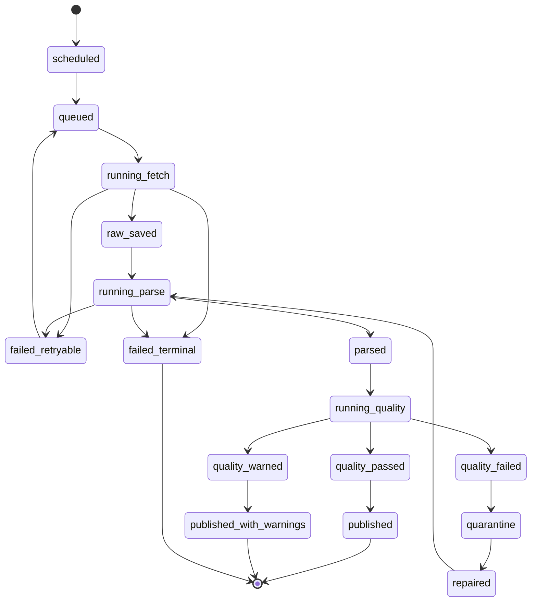

# 抓取任务状态机

状态：`Draft`

最后更新：2026-05-30

## 1. 目标

定义数据抓取任务从调度、请求、原始数据保存、解析、校验到发布的完整状态机。该状态机用于保证数据可追溯、任务可重试、失败可定位、发布可控。

## 2. 状态总览



## 3. 状态定义

| 状态 | 说明 | 可重试 | 可发布 |
|---|---|---|---|
| `scheduled` | 调度器已生成任务 | 是 | 否 |
| `queued` | 等待 worker 执行 | 是 | 否 |
| `running_fetch` | 正在请求源数据 | 是 | 否 |
| `raw_saved` | 原始响应已保存 | 是 | 否 |
| `running_parse` | 正在解析原始响应 | 是 | 否 |
| `parsed` | 已生成标准化候选记录 | 是 | 否 |
| `running_quality` | 正在做质量检查 | 是 | 否 |
| `quality_passed` | 质量检查通过 | 否 | 是 |
| `quality_warned` | 有警告但可发布 | 否 | 是 |
| `quality_failed` | 质量检查失败 | 否 | 否 |
| `published` | 已写入正式指标表 | 否 | 已发布 |
| `published_with_warnings` | 已发布但带质量警告 | 否 | 已发布 |
| `quarantine` | 隔离等待人工或修复任务 | 可修复 | 否 |
| `failed_retryable` | 临时失败 | 是 | 否 |
| `failed_terminal` | 不可自动恢复失败 | 否 | 否 |
| `repaired` | 修复完成，准备重跑解析/校验 | 是 | 否 |

## 4. 状态转换规则

### 4.1 调度到执行

`scheduled -> queued` 条件：

- 任务到达计划执行时间。
- 该 source 未超过并发限制。
- 没有相同幂等 key 的运行中任务。

`queued -> running_fetch` 条件：

- worker 获取锁成功。
- source rate limit 允许请求。

### 4.2 抓取阶段

`running_fetch -> raw_saved` 条件：

- HTTP 或文件请求成功。
- 响应体已写入 raw store。
- 已计算 response hash。

`running_fetch -> failed_retryable` 条件：

- 网络超时。
- 5xx。
- 429。
- 可恢复 DNS 或连接错误。

`running_fetch -> failed_terminal` 条件：

- 401/403 授权失败。
- 参数错误。
- license block。
- source 配置缺失。

### 4.3 解析阶段

`raw_saved -> running_parse` 条件：

- 找到匹配 parser version。
- raw payload 未被标记为重复且无需解析，或本次要求重新解析。

`running_parse -> parsed` 条件：

- 生成标准化候选记录。
- 解析警告未超过阈值。

`running_parse -> failed_terminal` 条件：

- schema 变化导致无法解析。
- 必需字段缺失。
- parser version 不兼容。

### 4.4 质量阶段

`parsed -> running_quality` 条件：

- 候选记录已写入 staging 表。

`running_quality -> quality_passed` 条件：

- 完整性、有效性、一致性、新鲜度检查通过。

`running_quality -> quality_warned` 条件：

- 出现可接受异常，例如少量缺失、发布延迟、节假日缺口。

`running_quality -> quality_failed` 条件：

- 大面积缺失。
- 单位异常。
- 日期倒退。
- 同一 key 多个冲突值。
- 值域明显不可能。

### 4.5 发布阶段

`quality_passed -> published` 条件：

- 发布锁获取成功。
- 幂等键无冲突。
- 写入指标表成功。

`quality_warned -> published_with_warnings` 条件：

- 警告级别低于阻断阈值。
- 前端可显示该指标质量提示。

`quality_failed -> quarantine` 条件：

- 失败记录需要保留以供排查。

## 5. 幂等 key

抓取任务幂等 key：

```text
source_id
dataset_id
run_mode
target_id
requested_start
requested_end
config_version
```

指标记录幂等 key：

```text
indicator_id
entity_id
as_of_date
frequency
source_id
revision_time
```

原始响应去重 key：

```text
source_id
dataset_id
request_params_hash
response_hash
```

## 6. 水位线设计

每个 dataset 维护独立水位线：

```text
source_id
dataset_id
target_id
last_successful_period
last_publication_time
last_revision_time
last_raw_payload_id
last_run_id
```

水位线只在成功发布后推进。抓取成功但解析失败不能推进水位线。

## 7. 重试策略

建议默认策略：

- 网络错误：最多 5 次，指数退避。
- 429：尊重 `Retry-After`，否则按 source 配置退避。
- 5xx：最多 5 次。
- 解析错误：不自动重试，进入 terminal 或 quarantine。
- 质量失败：不自动重试，等待修复任务。

## 8. 修复任务

修复任务适用场景：

- parser 版本升级。
- source 字段变化后补解析。
- 手工修复指标 mapping。
- 回填缺失区间。
- 处理历史修订。

修复任务不得绕过 raw store。即使是手工导入数据，也要生成 raw object 或 import batch 记录。

## 9. 前端可见状态

数据源监控页应显示：

- 最近成功时间。
- 当前状态。
- 连续失败次数。
- 延迟。
- 最近错误类型。
- 待重试任务数。
- 隔离任务数。
- 数据质量分。

用户看到的不是内部全部状态，而是简化为：

- 正常
- 延迟
- 部分异常
- 失败
- 停用

