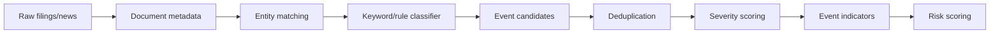

# 新闻、公告和 LLM 事件分析设计

状态：`Draft`

最后更新：2026-05-30

## 1. 目标

设计事件变量处理流程，用于从 SEC 公告、新闻 API、监管公告和后续 LLM 分析中提取金融风险事件。事件层用于补充市场和宏观数据，不能在第一版单独决定整体风险等级。

## 2. 数据来源

第一版：

- SEC EDGAR：上市公司申报、8-K、10-Q、10-K。
- GDELT：全球新闻检索、主题、语调。
- 官方监管公告 RSS 或网页，按授权确认后接入。

后续：

- 评级机构公告。
- 交易所公告。
- 债券违约公告。
- 商业新闻源。

## 3. 事件处理流程



LLM 后续插入位置：

```text
Event candidates -> LLM classification/extraction -> Human review/quality gate
```

## 4. 实体识别

实体类型：

- 公司。
- 银行。
- 国家。
- 行业。
- 监管机构。
- 资产或市场。

实体匹配优先级：

1. 官方 ID，例如 CIK、LEI、ticker。
2. 白名单名称。
3. 别名表。
4. 模糊匹配。

模糊匹配结果不能直接作为高严重度事件，必须标记置信度。

## 5. 事件分类

初始事件类型：

```text
bank_liquidity_stress
deposit_outflow
capital_shortfall
credit_default
rating_downgrade
regulatory_intervention
rescue_or_bailout
bankruptcy_or_resolution
market_dislocation
large_loss
fraud_or_governance
macro_policy_shock
geopolitical_shock
```

第一版分类方式：

- 表单类型。
- 关键词规则。
- 实体白名单。
- 负面语调阈值。
- 同类事件聚合数量。

## 6. SEC 公告规则

重点表单：

- 8-K：重大事件。
- 10-Q/10-K：风险因素、流动性、资本、信用风险。
- 13F/其他持仓相关数据后续再评估。

8-K 初始关注 item：

- 破产、接管或重组。
- 重大协议或融资变化。
- 财务报表依赖性变化。
- 董事和高管重大变化。
- 重大诉讼或监管事项。

处理原则：

- 先提取 metadata 和表单类型。
- 再抽取关键段落。
- 不直接把全文送入 LLM，先做规则缩小范围。

## 7. 新闻规则

GDELT 第一版输出日频事件指标：

```text
financial_stress_article_count
bank_stress_article_count
negative_tone_average
negative_tone_article_ratio
entity_event_count
```

查询策略：

- 金融压力关键词。
- 银行和大型金融机构实体。
- 国家或市场范围。
- 去重 URL。
- 按语言和来源过滤。

新闻层风险：

- 噪声高。
- 重复报道多。
- 标题党和转载多。
- 情绪指标容易过度反应。

因此第一版新闻只作为辅助贡献，权重较低。

## 8. LLM 使用边界

LLM 适合：

- 事件摘要。
- 分类候选。
- 实体关系抽取。
- 风险解释文本草稿。

LLM 不适合：

- 直接输出最终风险等级。
- 替代数据质量检查。
- 不留证据链的判断。

LLM 输出必须记录：

```text
model
prompt_version
input_document_id
output_json
confidence
evidence_spans
created_at
```

对于高严重度事件，必须保留原文证据片段和来源链接。

## 9. 事件严重度

事件严重度 0 到 100。

计算因素：

- 事件类型基础分。
- 实体重要性。
- 来源可信度。
- 重复来源数量。
- 是否有官方公告。
- 是否被市场压力指标确认。

示例：

```text
severity =
  base_event_score
  + entity_importance_boost
  + official_source_boost
  + multi_source_confirmation
  - low_confidence_penalty
```

## 10. 输出到指标层

事件层不直接写整体风险，只输出事件指标：

- 事件数量。
- 加权严重度。
- 高严重度事件数量。
- 负面新闻比例。
- 重大公告数量。

这些指标进入 `events_sentiment` 维度，再由评分引擎聚合。

## 11. 人工复核

L3/L4 相关事件建议支持人工复核：

- 确认事件类型。
- 调整严重度。
- 合并重复事件。
- 标记误报。

人工操作进入审计日志。

